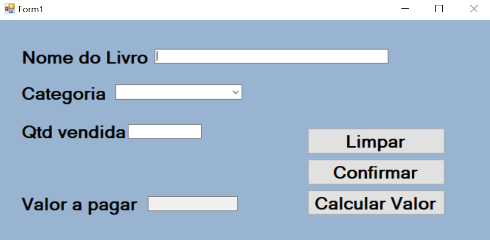

<h1 align="center"> 📚Livraria📔 </h1>

Projeto feito para a diciplina de Engenharia de software III, programa para calcular a compra de um livro📓 

  <a href="#-tecnologias">Tecnologias</a>&nbsp;&nbsp;&nbsp;|&nbsp;&nbsp;&nbsp;
  <a href="#-projeto">Projeto</a>&nbsp;&nbsp;&nbsp;

  

 

## 🚀 Tecnologias

Esse projeto foi desenvolvido com as seguintes tecnologias:

- Visual Studio
- C#
- .NETframework

## 💻 Projeto

Uma interface que faz o calculo da compra de um livro.

---

Feito com 💗 by Murilo Baron Pereira ✌